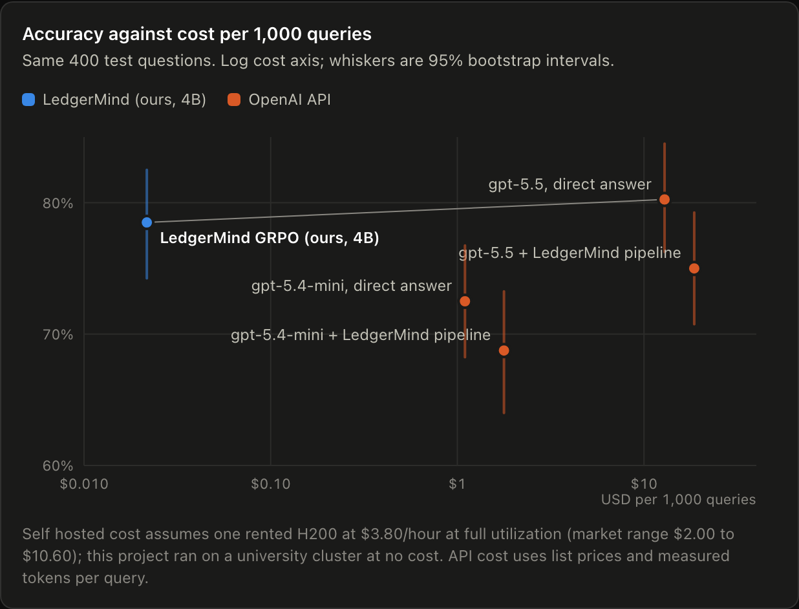
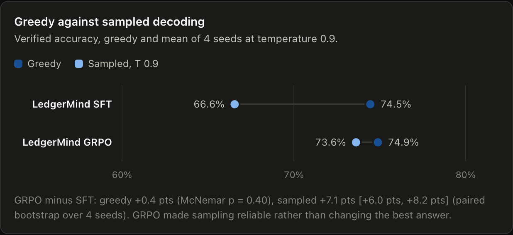
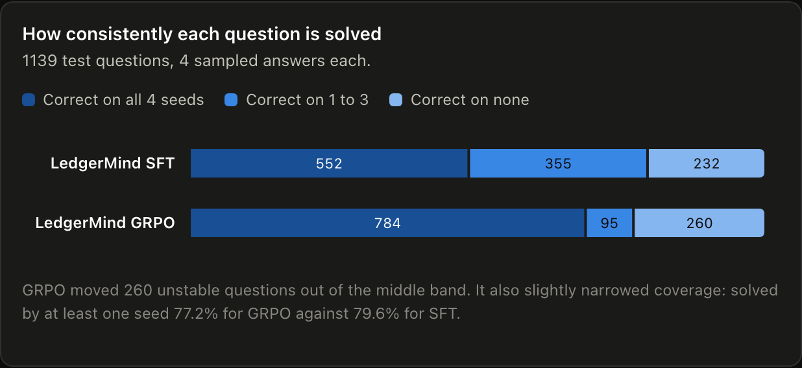

# LedgerMind

[](https://github.com/Govindrm7/LedgerMind/actions/workflows/ci.yml)
[](LICENSE)

**The LLM proposes. A deterministic verifier decides every number.**

A 4B open model, fine tuned with SFT and then GRPO against a verifier, answers FinQA questions **statistically tied with gpt-5.5** on the same questions, at **about 600 times lower cost per query** if self hosted, and every answer comes with the figures it used and where each one is printed.

**[Open the results dashboard and audit explorer](https://govindrm7.github.io/LedgerMind/)**



## For finance readers

[FinQA](https://github.com/czyssrs/FinQA) is a public benchmark of about 8,000 questions written by finance professionals over real S&P 500 earnings reports: a table from a 10-K plus the surrounding text, and a question that needs one to several calculation steps. A typical answer from LedgerMind looks like this:

> **Question** (AES, 2001 10-K): what percentage of scheduled maturities of total debt are due after 5 years?
>
> **Cited figures:** `e1 = 12,806` (debt maturities table, row "thereafter") and `e2 = 22,258` (same table, row "total"), both checked as printed at those cells.
> **Plan:** `e1 / e2`, run by a deterministic executor, not the model.
> **Answer:** 0.5753, that is 57.5%, accepted by the verifier and matching the gold answer.

If a cited figure is not printed where the model says it is, or the plan does not really use the figures, the answer is rejected with the reason instead of being returned. That is the property a reviewer, an auditor or a controller needs: every number is traceable to the source, and nothing is computed in the model's head. The [audit explorer](https://govindrm7.github.io/LedgerMind/#explorer) shows 30 such trails, including rejected and counterfactual cases.

## What this demonstrates

* **Post training:** LoRA SFT, then GRPO with verifiable rewards on one H200, with prompt filtering by SFT pass rate so every GRPO step has signal.
* **Reward and verifier design:** one verifier used as the GRPO reward, the inference gate and the scorer, with reward hacking holes closed (unused evidence penalty, plan sensitivity check, literal policy).
* **Evaluation rigor:** frozen held out test set, bootstrap intervals, paired McNemar tests on identical questions, deterministic reruns, and published caveats where the comparison favors this project.
* **Serving and cost:** vLLM in bf16 and fp8 with a concurrency sweep, the measured cost of constrained decoding, and cost per query against API list prices.
* **Engineering:** typed `src/` package, tests in CI, pinned environments, cluster jobs that resume across time limits, and every reported number traced to a committed artifact.

## Why

LLMs are unreliable at multistep financial arithmetic, and a wrong number looks exactly like a right one. LedgerMind never lets the model write the final number. The model cites figures with source pointers and writes a computation plan; a deterministic executor runs the plan; a verifier checks every cited figure against the document. The answer comes back with a full audit trail, or it is refused with a reason.

The verifier is also the reward: GRPO optimizes the model directly for answers that survive verification.

```
Question + Document
      │
      ▼
 Model (SFT + GRPO)  ──►  evidence with source pointers + computation plan
      │
      ▼
 Executor            ──►  the number (safe AST evaluation, no eval)
      │
      ▼
 Verifier            ──►  provenance · plan hygiene · invariants · document integrity
      │
      ▼
 Answer + audit trail, or REJECT with reason
```

## Results

All numbers are on FinQA test, scored by the same harness, and traced to files in [`docs/results`](docs/results) (index of jobs, settings and code versions in [`docs/results/README.md`](docs/results/README.md)). Verified accuracy means correct *and* accepted by the verifier, over all questions.

### Against frontier models, on the same 400 questions

| System | Verified accuracy | Answers verified | Cost per 1k queries |
|---|---|---|---|
| gpt-5.5, direct answer | 80.3% [76.3, 84.5] | no | $12.90 |
| **LedgerMind GRPO (4B, ours)** | **78.5% [74.3, 82.5]** | **yes** | **$0.022** |
| gpt-5.5 through the LedgerMind pipeline | 75.0% | yes | $18.59 |
| gpt-5.4-mini, direct answer | 72.5% | no | $1.10 |
| gpt-5.4-mini through the LedgerMind pipeline | 68.8% | yes | $1.78 |
| Qwen3-4B base, zero shot | 21.3% | yes | |

Paired on identical questions (McNemar): GRPO against gpt-5.5 direct is **1.75 points lower, p = 0.38, a tie**; against gpt-5.5 through the pipeline it is 3.5 points higher, p = 0.08, also not significant; it beats gpt-5.4-mini both ways (p = 0.009 direct, p < 0.001 pipeline). The 400 questions are a seeded sample of the 1,139 grounded test questions, so intervals are about 4 points wide.

### What each training stage did, on all 1,139 test questions

| | Base, zero shot | + SFT | + GRPO | GRPO in fp8 |
|---|---|---|---|---|
| Verified accuracy | 20.4% | 74.5% | **74.9%** [72.3, 77.3] | 74.9% |
| Fabricated figures | 46.6% | 1.9% | **1.7%** | 1.5% |
| Unconstrained JSON parse | 80.4% | 99.9% | 99.9% | 99.9% |

SFT does the heavy lifting (+54.1 points, p < 0.001). GRPO's gain under greedy decoding is not significant (+0.4 points, p = 0.40), but sampled at temperature 0.9 it is large: **+7.1 points [+6.0, +8.2]** over four seeds, and the questions solved on every seed rise from 552 to 784. GRPO sharpened the policy rather than changing its best answer, with a small cost in breadth (solved on at least one seed: 79.6% for SFT, 77.2% for GRPO).

<p>


</p>

### Serving

On one H200 with vLLM, the GRPO model serves 44.7 requests per second at concurrency 64 in bf16 and 48.7 in fp8, with identical accuracy (74.89% both, 7 against 7 discordant answers). JSON schema constrained decoding halves peak throughput to about 21 requests per second, and the trained model does not need it: it produces valid JSON 99.9% of the time unconstrained.

### Adversarial testing (the Saboteur)

| Test | Result |
|---|---|
| Mode A: corrupted model outputs caught (7,212 injected faults, 8 types) | 100% |
| Mode B: stale answers rejected after the document is tampered with | 99.7 to 100% |
| Mode B: tampering flagged when a printed total covers the cell | 65 to 85% |
| Mode C: answers recalling the real filing on counterfactual documents | 4 of 846 (0.5%) |
| Verifier false rejections on correct gold answers | 0.8% |

Mode B has a real limit: about two thirds of tampered cells sit outside any total and cannot be detected from the document alone.

## Read this before quoting the numbers

* **Specialist against generalist.** LedgerMind was trained on FinQA's training split and learned its conventions; the API models see the task cold. The claim is that a small specialist matches a general flagship on this task.
* **The pipeline prompt v1 favors the trained models.** It names its functions without defining argument order and asks for millions to be converted to units, while FinQA answers stay in document units. A post hoc count puts the cost to gpt-5.5 through the pipeline at about 8 points. Prompt v2 fixes both; the API pipeline numbers above use v1.
* **Direct answers are scored at the precision they state** (1.64 counts for 1.63657), a rule added after reading the first outputs, where correctly rounded answers were marked wrong. Default scoring of the same answers gives 42.0% for gpt-5.5 and is reported too.
* **Cost** for the self hosted model assumes a rented H200 at $3.80 per hour (market range $2.00 to $10.60) at full utilization; the runs used a university cluster. API cost is list price times measured tokens. The frontier baselines actually cost $16.52 under a hard $20 cap.
* **Determinism.** Scored runs use vLLM's batch invariant kernels; two reruns produced identical outputs on all 1,139 questions, which the paired tests rely on.

## What the verifier checks

| Gate | Catches |
|---|---|
| **Provenance** | a figure not printed where it is cited: fabricated, wrong row, wrong period, wrong sign, wrong scale |
| **Plan hygiene** | a plan that does not really compute from the evidence, including disguised constants like `e1 - e1 + 12` (caught by a sensitivity check) |
| **Invariants** | dimensional errors: percent combined with dollars, millions with billions, quarterly with annual |
| **Integrity** | tampered source tables, via line items that no longer sum to their totals |

## Repository layout

```
src/ledgermind/   numbers, schema, document, dsl (executor), verifier, saboteur, data (FinQA),
                  rewards, training helpers, eval (harness, paired tests, cost), serving
training/         SFT and GRPO scripts, adapter merge, pass rate filter, configs
serving/          vLLM launch script, live demo page
slurm/            cluster jobs: data prep, SFT, GRPO, evaluation, benchmarks, demo
scripts/          dashboard data builder
docs/             DESIGN.md, the dashboard (GitHub Pages), every result file cited here
tests/            unit tests, run in CI on Python 3.11 and 3.12
```

## Quickstart

```bash
uv sync
uv run pytest
uv run python -m ledgermind.data.prepare      # download, verify and convert FinQA
uv run python -m ledgermind.eval.oracle       # gold programs through the executor

# Recompute any paired comparison from the committed per question verdicts
uv run python -m ledgermind.eval.compare --a docs/results/eval/grpo_test_rows.jsonl \
    --b docs/results/eval/sft_bi1_test_rows.jsonl
```

Training, serving and benchmark commands are in [`docs/DESIGN.md`](docs/DESIGN.md#9-reproducing); the cluster jobs that produced every result are in [`slurm/`](slurm).

## License

Apache 2.0. See [LICENSE](LICENSE).
